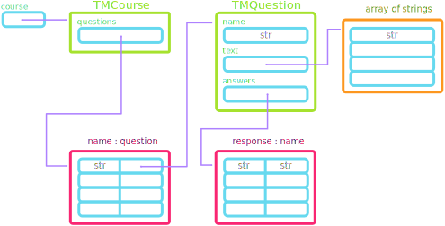
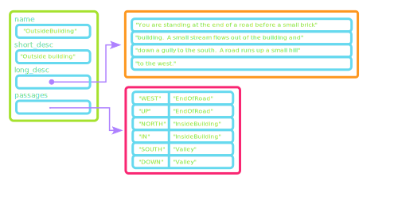

## Rehashing Classes
- The Adventure project relies heavily on classes, and so it is worth reviewing the basics of class definitions before wading into the data structure complexity of Adventure
- Of particular importance are:
  - Understanding the role of a constructor function in a class
  - Understanding how to define and utilize getter and setter methods
  - Understanding when and where the `self` variable name needs to be utilized
- The first problem today will practice these topics

# Problem 1
## Classy Inventories
- Suppose you run a shop, and were working on code to better help you manage and understand your inventory. At any given time, you have certain items for sale, each of which has a price and some stock associated with it.
- Here your task begins with writing an `Item` class that will store 3 pieces of information as attributes:
  - The name of the item as a string
  - The current stock of the item as an integer
  - The current price of the item as a float
- Whenever a new `Item` object is created, all three pieces of information will be passed in as arguments:
  ```mypython
  umbrellas = Item("Umbrella", 5, 13.99)
  ```

## Inventory Initialization Possibility
- One solution to setting this up might look like:
  ```mypython
  class Item:
    def __init__(self, name, stock, price):
      self.name = name
      self.stock = stock
      self.price = price
  ```

## Classier Inventories
- We can do much more than just store attributes in a class though, and bundling common operations together in a class as methods is often useful.
- Here you should add two methods to your `Item` class:
  - A `restock` method which takes an integer as an argument and increases the stock of that item by the given integer. No value is returned.
  - A `purchase` method which takes an integer indicating the _desired_ amount of the item to purchase. If that number of items is in stock, they are removed from the stock and the returned value is equal to the total amount the user would be charged. If the desired number is greater than the number of items in stock, sell them all that are available, but print a warning message.


## Checking Out
- Completed properly, your program should be able to mimic the following:
  ```{.mypython style='max-height:900px'}
  >>> ball = Item("Red ball", 10, 2.50)
  >>> ball.purchase(6)
  15
  >>> ball.purchase(6)
  Warning: Ran out of Red balls! You only got 4!
  10
  >>> ball.restock(8)
  >>> ball.purchase(6)
  15
  >>> ball.purchase(6)
  Warning: Ran out of Red balls! You only got 2!
  5
  ```

## Method Solutions
```{.mypython style='font-size:.9em; max-height:900px'}
  class Item:
    def __init__(self, name, stock, price):
      self.name = name
      self.stock = stock
      self.price = price

    def restock(self, num):
      self.stock += num

    def purchase(self, num):
      if num <= self.stock:
        self.stock -= num
        return num * self.price
      sold = self.stock
      self.stock = 0
      print(f"Warning: Ran out of {self.name}s! You only got {sold}.")
      return sold * self.price
```

# Prepping for Adventure
## The Adventure Begins
- In terms of the amount of code to write, Adventure is roughly comparable to the Breakout project. What makes Adventure challenging though is the interconnection of its various data structures.
- The project includes 3 separate classes:
  - `AdvGame`
  - `AdvRoom`
  - `AdvItem`
  
  each of which internally utilize Python lists, dictionaries, and tuples

## Adventure Strategies:
:::incremental
- Ensure that you thoroughly understand the `TeachingMachine.py` program before moving on to Adventure. 
  - Most of the parts you need are already there, you just need to determine how to adapt them.
- Don't try to keep the entire data structure in your head all at once. 
  - Consider each class, figure out what it does, and then think abstractly about what that class represents rather than worrying about the details
- Keep close track of what Python types your variables are storing. 
  - Choose good variable names that help you remember specifically what a particular variable is storing. Students thinking a variable has one thing in it when it is actually storing a different data type is a very common source of confusion with Adventure.
:::

## Understanding the Teaching Machine
:::{style='font-size:.9em'}
- Like the Adventure project, the `TeachingMachine.py` program is data-driven, encoding the details of its operation in data files rather than in the program itself
- The `TeachingMachine.py` program begins by reading in a data file and translating the human-readable contents of the file into an internal data structure, shown on the next slide.
- When designing the internal data structure for data-driven applications, you should consider what types of common operations the structure needs to support.
  - In the Teaching Machine, each question specifies a collection of possible answers, each of which directs to a new question. Such a relationship suggests a dictionary would be useful.
  - Similarly, the course as a whole consists of a collection of questions referenced by a unique name. Thus, once again a dictionary seems like the best internal structure.
:::


## Teaching Structure


# Problem 2
## Matching text to data structure
- As a first step toward making the conversion to the Adventure program, it is useful to draw out a similar diagram showing the desired internal data structure for the Adventure game
- In this problem you'll just focus on the `AdvRoom` class.
  - The next slide shows the contents of the first room of the `TinyRooms.txt` data file, one of the three supplied to you with the Adventure project. Draw a pencil-and-paper diagram showing what a **filled** internal data structure would look like.
  - The format of the data file has something extra that the Teaching Machine did not have: a short description. How should you incorporate that?
  - Clearly indicate the new names you will assign to each of the attributes


## `TinyRooms.txt` (Room 1)
```{.text style='max-height:900px; font-size:.8em'}
OutsideBuilding
Outside building
You are standing at the end of a road before a small brick
building.  A small stream flows out of the building and
down a gully to the south.  A road runs up a small hill
to the west.
-----
WEST: EndOfRoad
UP: EndOfRoad
NORTH: InsideBuilding
IN: InsideBuilding
SOUTH: Valley
DOWN: Valley
```

## Problem 1: One Solution



## Continuing the Conversion
- Once you understand clearly what different parts of the Teaching Machine program accomplish and what the corresponding things are named in Adventure, you can start effectively accomplishing Milestone 1
- **One other thing to be careful of:**
  - In the Teaching Machine, the data file was opened in `TeachingMachine.py` and the file handle was passed directly into the `TMCourse` constructor.
  - In the Adventure, the data file will be opened inside the `AdvGame` constructor, and only the file name prefix is determined and then passed on from `Adventure.py`
  - This difference is logic stems from the fact that eventually you'll need to be opening and reading from multiple files in `AdvGame`, and so it makes more sense to handle all of that internally in the `AdvGame` constructor.


<!-- move to next week

## Problem 2
:::incremental
- Currently, the `TeachingMachine.py` program gives no feedback when the user gives an incorrect answer.
  - Quickly brainstorm some ways you could try to implement this? What extra data structures might you need?
- There are many possible strategies, but the one Will Crowther arrived at was reusing the `AdvRoom` class (`TMQuestion` here)
  - Want the new "question" to display text to the screen, but **not** to prompt the user for a response
  - Instead, a `FORCED` response in the `answers` dictionary indicates that the program should **immediately** proceed to the indicated question
:::


## Forced Questions
- An example of such a question might look like:
  ```text
  Q3Resp
  You forgot to divide by 2.
  -----
  FORCED: Q3
  ```
- Implementing this in `TMCourse.py` requires only a small change:
  - The `run` method for `TMCourse` is shown on the next slide. Identify on what lines changes will need to be made.
  - Make the changes to allow for `FORCED` questions in the Teaching Machine.


## `TMCourse.run` {data-auto-animate=true}
```{.mypython style='max-height:950px; font-size:.8em' data-id='mycode' data-line-numbers=true}
def run(self):
    """Steps through the questions in this course."""
    current = "START"
    while current != "EXIT":
        question = self._questions[current]
        for line in question.get_text():
            print(line)
        answers = question.get_answers()
        response = input("> ").strip().upper()
        next_question = answers.get(response, None)
        if next_question is None:
            next_question = answers.get("*", None)
        if next_question is None:
            print("I don't understand that response.")
        else:
            current = next_question
```

## `TMCourse.run` {data-auto-animate=true}
```{.mypython style='max-height:950px; font-size:.8em' data-id='mycode' data-line-numbers='9-10|19-20'}
def run(self):
    """Steps through the questions in this course."""
    current = "START"
    while current != "EXIT":
        question = self._questions[current]
        for line in question.get_text():
            print(line)
        answers = question.get_answers()
        forced_question = answers.get("FORCED", None)
        if forced_question is None:
            response = input("> ").strip().upper()
            next_question = answers.get(response, None)
            if next_question is None:
                next_question = answers.get("*", None)
            if next_question is None:
                print("I don't understand that response.")
            else:
                current = next_question
        else:
            current = forced_question
```

## Problem 3
- The primary computing story throughout most of 2023 has revolved around generative AI and large-language models.
- While the underlying software for something like ChatGPT is much more complex, the core technology is based on a _large-language model_ (LLM) that scans a massive volume of text and then uses that data to create sentences in which new words are chosen based on the frequency in which they appear in the context of the words already generated.
- ChatGPT uses complex contextual information to predict the next word, but one can construct a much simpler language-generation model that uses only the previous word to guess what word comes next.


## Building the Model
- To build a simplified language model that uses a single word as the context, all you need to do is create a dictionary in which each key is a word that appears in your text (often called the _corpus_) and the corresponding value is a list of all the words that follow that key.
- To get a sense for how this process works, it helps to start with a small corpus, which might consist of the following three lines from Shakespeare's _Macbeth_:

  ```text
  Tomorrow, and tomorrow, and tomorrow
  Creeps in this petty pace from day to day
  To the last syllable of recorded time;
  ```
- The dictionary that serves as our model must show, for example, that the word `"tomorrow"` appears three times, twice followed by the word `"and"` and once followed by `"creeps"`.


## The "MacBeth" Language Model
- The complete dictionary would look like:
  ```mypython
  {
      "and": ["tomorrow", "tomorrow"],
      "creeps": ["in"],
      "day": ["to", "to"],
      "from": ["day"],
      "in": ["this"],
      "last": ["syllable"],
      "of": ["recorded"],
      "pace": ["from"],
      "petty": ["pace"],
      "recorded": ["time"],
      "syllable": ["of"],
      "the": ["last"],
      "this": ["petty"],
      "time": [],
      "to": ["day", "the"],
      "tomorrow": ["and", "and", "creeps"]
  }
  ```

## Token Building
- To build such a dictionary, you need to select off one word at a time from your corpus, appending it to the correct list in your dictionary.
- This is an excellent time to make use of the TokenScanner library and class!
- Remember that to do so you need to initialize the TokenScanner, and then iterate through as long as their remain tokens, retrieving each as you go.
- Write a function called `create_model(text)` which uses the TokenScanner library to parse the provided text to create a simple dictionary language model, as shown on the previous slide.


## Token Solution
```{.mypython style='max-height: 900px; font-size:.9em'}
def create_model(text):
    """Returns the language-model dictionary 
    for the provided text."""
    scanner = TokenScanner(text)
    model = { }
    previous = None
    while scanner.has_more_tokens():
        word = scanner.next_token().lower()
        if word.isalpha():
            if word not in model:
                model[word] = [ ]
            if previous is not None:
                model[previous].append(word)
            previous = word
    return model
```

-->
