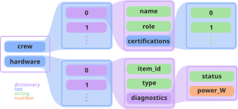

# Problem 1
## Navigating Compound Data Structures
- Project 5 requires reading in and working with a large, nested data structure that holds all of the existing content that comprises a given story.
- Navigating your way around that structure, looping over and selecting out the pieces of information that you need, will be the most conceptually difficult task in the first milestones.
- This first problem is intended to get you some practice thinking about, and working with these nested structures.

## Space Missions
:::{style='font-size:.9em'}
- Your data in this problem comes in a JSON format, and represents a collection of fictional space missions
- Each mission contains information about:
  - the crew involved, including
    - their names (which are unique)
    - their role on the mission
    - their certifications
  - various pieces of hardware and some diagnostics, including
    - the hardware name
    - the hardware type (what category it belongs to)
    - any diagnostics, which include
      - the status of the hardware
      - the power emitted by the hardware in watts
:::

## Visualizing the Data
- It can be useful to visualize the structure to help organize it in your thoughts, and provide a reference for various names



## Parts of a Mission

Part A
: Write a function called `load_data` that loads in the data from the JSON and returns the dictionary.

Part B
: Write a function called `eva_count` which counts and returns the number of **different** crew members who have an `"EVA"` certification and participated in a mission that began with an "A".

Part C
: Write a function called `power_missions` which returns a set of all the mission names where the **Navigation** hardware averaged over 100 W of power.

## Possible Solutions
```{.python style='font-size:.7em; max-height: 900px'}
import json

def load_data():
    with open('./space_missions.json') as fh:
        data = json.load(fh)
    return data


def eva_count(data):
    """
    How many _different_ crew members have EVA certification and have served
    on missions that begin with an A?
    """
    eva_crew = set() # Accounting for duplicate crew across missions
    for mission_name, mission_data in data.items():
        if mission_name.startswith("A"):
            for crew_dict in mission_data["crew"]:
                if "EVA" in crew_dict["certifications"]:
                    eva_crew.add(crew_dict["name"])
    return len(eva_crew)


def power_missions(data):
    """
    What are the unique mission names where Navigation equipment, on average,
    was drawing more than 100 W?
    """
    missions = set()
    for mission_name, mission_data in data.items():
        nav_power_readings = []
        for item_dict in mission_data["hardware"]:
            if item_dict["type"] == "Navigation":
                nav_power_readings.append(item_dict["diagnostics"]["power_W"])
        if sum(nav_power_readings) / len(nav_power_readings) > 100:
            missions.add(mission_name)
    return missions
```

# Problem 2
## The NotOpenAI API
- A core part of the functionality of the Infinite Adventure project requires being able to use the NotOpenAI library to send prompts to ChatGPT
- Recall that this library is set up to perfectly mimic the use of the real OpenAI library, but in a way that costs you no money!
- As such, we need to utilize the library in particular ways

## Components of a NotOpenAI Call
```{.mypython style='max-height:900px; font-size: .8em'}
CLIENT = NotOpenAI(api_key="yourapikey") # Create the client

chat_completion = CLIENT.chat.completions.create(
	messages=[
		|||Dictionary with payload|||
	],
	model=|||model to use|||,
	response_format={"type": "json_object"} # if json requested
)
response_str = chat_completion.choices[0].message.content
|||Convert json content to Python data structures|||
```

## The Pieces
- The Payload dictionary:
	- **Must** have keys of `"role"` and `"content"`
	- `"role"` is always set to `"user"`
	- `"content"` is assigned the text of your prompt
- The model:
	- Lots of different models available from OpenAI
	- NotOpenAI only is supporting `"gpt-4o-mini"`


## Your Task
- Use the NotOpenAPI to retrieve a JSON structure that contains information on the top 5 most influential adventure games of all time. Your structure should include:
	- Game name
	- The creator
	- The publishing year
	- A one sentence description of why it was influential
- Your overall goal is to print out the names of both the earliest and latest published games returned to you.

## Guiding ChatGPT
- Left to its own devises, ChatGPT might give you any structure and keys with this information, which makes it very difficult to write code to work with what is returned!
- Thus, it is always good to give it a sample of what you want
- If you already an example as a Python dictionary, you can just call `str()` on it to convert it to a string that you could include in your prompt


## Possible Solution
```{.python style='font-size:.7em; max-height: 900px;'}

"""
Utilizes the NotOpenAI API to retrieve and parse a response from ChatGPT
"""

from notopenai import NotOpenAI
import json

SAMPLE = {'games': [
    {
        'name': 'The Great WU Adventure', 
        'creator': 'Jed Rembord',
        'pub_year': 2026,
        'desc': 'A groundbreaking text adventure about a duck living in the Mill Stream.'
    },
    {
        'name': 'Revenge of the Nutria', 
        'creator': 'Jed Rembord',
        'pub_year': 2026,
        'desc': 'A horror adventure game about zombified nutria'
    },
]
}

CLIENT = NotOpenAI(api_key='yourkey')

prompt = f"Give me the top 5 most influential adventure games in a JSON format. The JSON should be formatted exactly like {str(SAMPLE)} where the outer element is a list and each interior game dictionary should contain the name of the game, the creator, the published year, and a one sentence description of why it was influential."

chat_completion = CLIENT.chat.completions.create(
    messages=[
      {
        'role': 'user',
        'content': prompt
      }
    ],
    model="gpt-4o-mini",
    response_format={"type": "json_object"} 
)
response_str = chat_completion.choices[0].message.content
data = json.loads(response_str)

print(data)

newest = data['games'][0]
oldest = data['games'][0]
for game in data['games']:
    if newest['pub_year'] < game['pub_year']:
        newest = game
    if oldest['pub_year'] > game['pub_year']:
        oldest = game
print(f"The oldest game is {oldest['name']}, published in {oldest['pub_year']}.")
print(f"The newest game is {newest['name']}, published in {newest['pub_year']}.")
```
